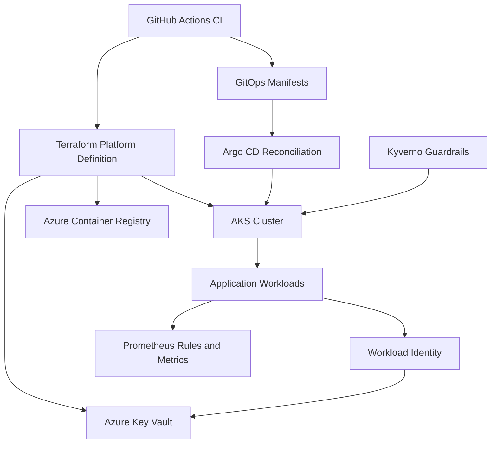

# Secure AKS Service Blueprint

Secure-by-default AKS reference platform demonstrating infrastructure as code, cloud/workload identity, policy enforcement, GitOps reconciliation, reliability engineering, and software supply-chain controls.

## What this demonstrates

| Capability | Implementation |
| --- | --- |
| Modular AKS Terraform | `infra/terraform/modules/*` composed by `environments/dev` and `environments/prod` |
| Azure Workload Identity | AKS OIDC issuer + federated identity credential for Kubernetes ServiceAccount subject |
| Key Vault access without app secrets | UAMI with `Key Vault Secrets User`, no app-level secret injection |
| ACR least-privilege pull path | AKS kubelet identity granted `AcrPull` |
| Kyverno admission guardrails | Runtime, supply-chain, and workload-contract policies |
| Secure workload contract | Required labels, probes, service account, and runtime controls |
| Prometheus SLO / burn-rate alerts | Recording rules + multi-window alert tests via promtool |
| GitOps reconciliation | Argo CD Application manifests for dev/prod with automated prune + self-heal |
| HIGH/CRITICAL vulnerability blocking | Trivy fs/image blocking gates in CI |
| CycloneDX SBOM generation | `sbom.xml` artifact generated in CI |
| Digest-pinned deployment | Helm supports `image.repository@sha256:digest` via `image.digest` |
| Tested negative security cases | Known-bad fixture must fail Trivy config gate |

## Architecture overview



More detail: [docs/architecture.md](docs/architecture.md)

## Security controls

| Area | Control | Enforcement |
| --- | --- | --- |
| Identity | Azure Workload Identity | Terraform + Kubernetes ServiceAccount subject contract |
| Secrets | Key Vault read via managed identity | Azure RBAC (`Key Vault Secrets User`) |
| Images | Approved registry | Kyverno supply-chain policy |
| Images | No `:latest` | Kyverno supply-chain policy |
| Containers | Non-root, RO filesystem, dropped caps | Kyverno runtime policy + Helm defaults |
| Supply chain | HIGH/CRITICAL vulnerability gate | Trivy fs/image blocking CI steps |
| Supply chain | SBOM generation | Trivy CycloneDX artifact in CI |
| Reliability | SLO and burn-rate alerts | Prometheus rules + promtool tests |
| Delivery | Desired-state reconciliation | Argo CD automated sync/prune/self-heal |

## Implemented vs deferred

### Implemented and locally/CI validated

- Terraform implementation for AKS/ACR/Key Vault/identity wiring
- GitHub OIDC workflow definition for infrastructure plan/apply
- Kyverno policies with compliant and violating test fixtures
- GitOps manifests and environment-specific values
- Trivy vulnerability gates + SBOM + exception governance validation
- Prometheus SLO rule checks and alert-behavior tests

### Live Azure acceptance deferred

Live Azure acceptance is intentionally deferred to optional final portfolio validation:

- GitHub OIDC -> Azure authentication proof
- Terraform live apply
- AKS cluster creation proof
- Live kubelet pull from ACR
- Live Workload Identity -> Key Vault secret access

Deferred does **not** mean the design is failed; it means live-cloud execution is out of scope for standard repository CI.

## Repository structure

- [infra/terraform/](infra/terraform/) - Terraform modules, environment roots, and state bootstrap
- [platform/policies/](platform/policies/) - Kyverno policy packs and tests
- [platform/workload-contract/](platform/workload-contract/) - Workload contract expectations
- [platform/sre/prometheus/](platform/sre/prometheus/) - SLO recording and alerting rules/tests
- [gitops/](gitops/) - Argo CD applications and environment values
- [security/](security/) - Vulnerability exception governance record
- [examples/](examples/) - Compliant and violating manifest fixtures
- [tests/](tests/) - Python unit/integration tests
- [docs/](docs/) - Architecture, security, deployment, runbook, and ADRs

## Local / CI validation

The standard validation path requires no Azure credentials:

```bash
python -m ruff check .
python -m pytest -q
python scripts/validate_vulnerability_exceptions.py
terraform -chdir=infra/terraform fmt -check -recursive
terraform -chdir=infra/terraform/environments/dev init -backend=false
terraform -chdir=infra/terraform/environments/dev validate
tflint --chdir=infra/terraform/environments/dev --init --config=../../.tflint.hcl
tflint --chdir=infra/terraform/environments/dev --config=../../.tflint.hcl
trivy config --exit-code 1 --severity HIGH,CRITICAL infra/terraform
docker build -t secure-aks-service:ci .
trivy fs --exit-code 1 --severity HIGH,CRITICAL --ignorefile .trivyignore .
trivy image --exit-code 1 --severity HIGH,CRITICAL --ignorefile .trivyignore secure-aks-service:ci
docker run --rm -v "$PWD:/work" -w /work ghcr.io/kyverno/kyverno-cli:v1.12.6 test platform/policies/tests
docker run --rm --entrypoint promtool -v "$PWD:/work" -w /work prom/prometheus:v2.55.0 check rules platform/sre/prometheus/slo-rules.yaml
docker run --rm --entrypoint promtool -v "$PWD:/work" -w /work prom/prometheus:v2.55.0 test rules platform/sre/prometheus/slo-alert-tests.yaml
docker run --rm -v "$PWD:/work" -w /work ghcr.io/yannh/kubeconform:v0.6.7 -strict -ignore-missing-schemas gitops/argocd/applications/*.yaml
```

For optional live Azure validation, see [docs/deployment.md](docs/deployment.md) and [docs/demo-guide.md](docs/demo-guide.md).

## Key documentation

- [docs/architecture.md](docs/architecture.md)
- [docs/security.md](docs/security.md)
- [docs/deployment.md](docs/deployment.md)
- [docs/demo-guide.md](docs/demo-guide.md)
- [docs/reliability-runbook.md](docs/reliability-runbook.md)
- [docs/adr/](docs/adr/)
